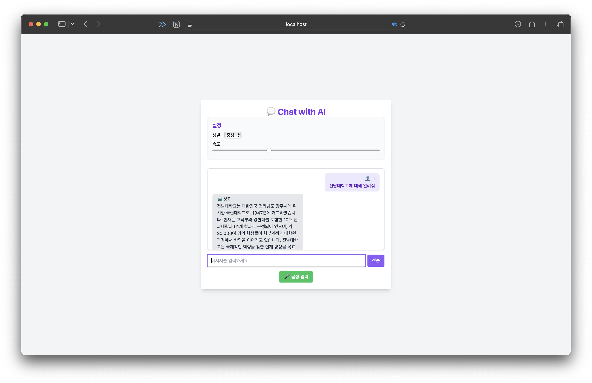

# Intelligent-HCI
2025-1학기 지능HCI 과제 대화형 Chatbot 만들기

# 🧠 Intelligent-HCI

2025-1학기 지능HCI 과제: 대화형 Chatbot 시스템 구현

## 프로젝트 개요

본 프로젝트는 React와 Node.js 기반으로 구성된 **지능형 음성 대화 챗봇 시스템**입니다. 사용자는 **음성 또는 텍스트로 질문**을 입력하고, 챗봇은 **ChatGPT(OpenAI)**를 통해 응답을 생성하며, 결과는 **Google TTS**를 통해 다시 음성으로 출력됩니다.  
또한, 사용자가 음성의 **성별 및 속도 설정**을 할 수 있는 **설정 패널(SettingsPanel)**을 포함합니다.

---

## 시스템 구성도


### 💻 화면 UI 예시




---

## 주요 기능

- **Google STT**: 사용자 음성을 텍스트로 변환  
- **OpenAI GPT**: 텍스트 입력에 따른 자연어 응답 생성  
- **Google TTS**: 응답을 자연스러운 음성으로 출력  
- **설정 패널(SettingsPanel)**:  
  - 성별(Gender): NEUTRAL / MALE / FEMALE  
  - 속도(Speed): 0.5x ~ 2x 조절 가능  

---

## 실행 방법

1. `.env` 파일에 API 키 설정 (Google & OpenAI)
2. 서버 실행:
   ```bash
   cd server
   npm install
   npm start
   ```
3. 클라이언트 실행:
   ```bash
   cd client
   npm install
   npm run dev
   ```

---

## 기여자

- 박영서